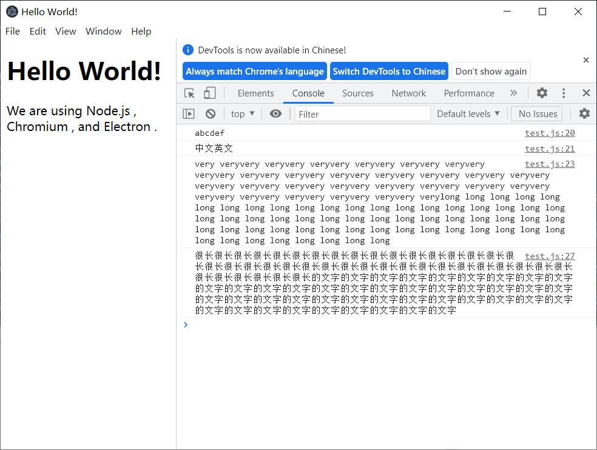

# electron-call-dll-with-string

calling functions with string param/return in dll with electronjs 
在 electronjs 中调用带有字符串参数/返回值的 dll 函数

## 文件结构

- dll_project vs2019，包含dll和控制台测试调用
- electron_app electron项目，拷贝对应x86/64版本dll过来才可运行

## 截图
