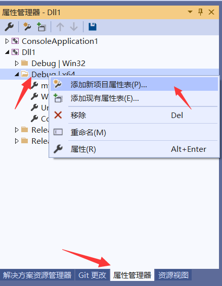

# dll项目

参考文档：https://docs.microsoft.com/en-us/cpp/build/walkthrough-creating-and-using-a-dynamic-link-library-cpp?view=msvc-170

## 步骤

使用sln打开可直接跳到【编译构建】

创建项目

添加文件
- [MathLibrary.h](../../dll_project/Dll1/MathLibrary.h)
- [MathLibrary.cpp](../../dll_project/Dll1/MathLibrary.cpp)

定义宏

编译构建
